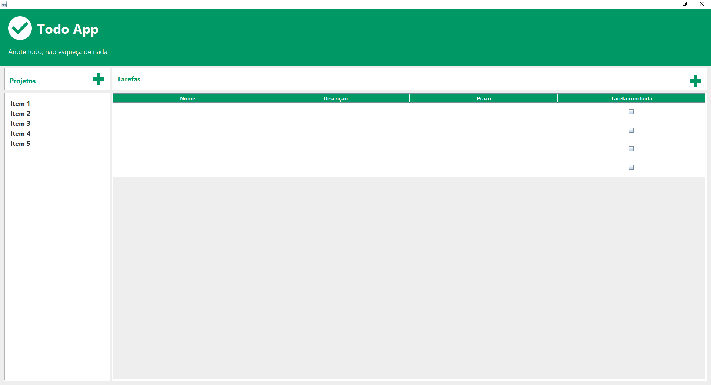

# Todo App - Gerenciamento de projetos e tarefas

> Todo App - Aplicação para cadastro de projetos e tarefas.

📝 Projeto criado para aprendizagem em Java utilizando banco de dados (MySQL) 📝

[🔗 Clique aqui para acessar.](https://danielkistemacher.github.io/TodoApp/)

## 🛠 Tecnologias

- Java
- MySQL
- Git e GitHub

## ⚠ Informações do projeto

- Tela inicial contendo as opções para:  
    -> Cadastro de projetos. 
    -> Cadastro de tarefas, vinculadas a um projeto. 
    -> Listagem dos projetos. 
    -> Listagem das tarefas. 
        -> Informação das tarefas com: nome, descrição, prazo e status. 
 

## ✉ Contato
E-mail: danielkistemacher@gmail.com  
LinkedIn: https://www.linkedin.com/in/daniel-kistemacher-da-silva-525422219/